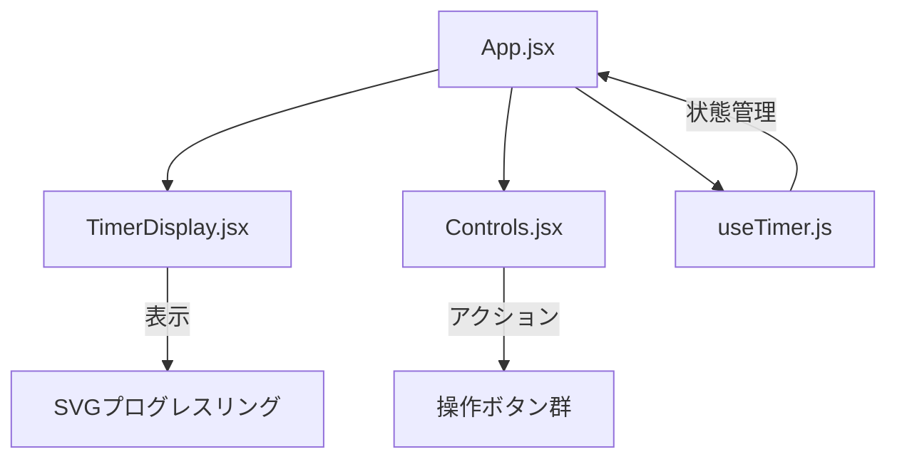
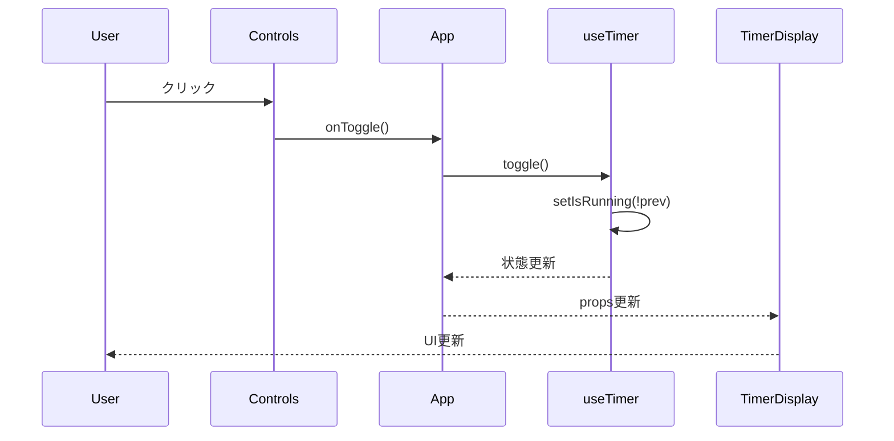

# Tomatic - コンポーネント設計書

## コンポーネント構成図



## 1. App コンポーネント

**ファイル:** `src/App.jsx`

**責務:**
- アプリケーション全体のレイアウト
- useTimerフックの呼び出し
- 子コンポーネントへのprops配布

**構造:**
```jsx
<div className="app">
  <div className="app-container glass-card">
    <header>タイトル + フェーズ表示</header>
    <main>
      <TimerDisplay />
      <Controls />
    </main>
    <footer>完了ポモドーロ数</footer>
  </div>
</div>
```

---

## 2. TimerDisplay コンポーネント

**ファイル:** `src/components/TimerDisplay.jsx`

**責務:**
- 残り時間の表示（MM:SS形式）
- SVG円形プログレスリングの描画
- 実行中アニメーションの制御

**Props:**

| Prop | 型 | 説明 |
|------|------|------|
| `timeLeft` | number | 残り時間（秒） |
| `progress` | number | 進捗率（0〜1） |
| `color` | string | プログレスリング色 |
| `isRunning` | boolean | タイマー実行状態 |

**SVG仕様:**
- サイズ: 280x280px
- ストローク幅: 8px
- アニメーション: `stroke-dashoffset`で進捗表現

---

## 3. Controls コンポーネント

**ファイル:** `src/components/Controls.jsx`

**責務:**
- リセットボタン
- 開始/一時停止ボタン（トグル）
- スキップボタン

**Props:**

| Prop | 型 | 説明 |
|------|------|------|
| `isRunning` | boolean | タイマー実行状態 |
| `onToggle` | function | 開始/停止切替 |
| `onReset` | function | リセット処理 |
| `onSkip` | function | スキップ処理 |
| `color` | string | ボタン色 |

**ボタン仕様:**

| ボタン | サイズ | 機能 |
|--------|--------|------|
| リセット | 64px | 現在フェーズをリセット |
| 開始/停止 | 92px | タイマー制御（メイン） |
| スキップ | 64px | 次フェーズへ移動 |

---

## 4. useTimer カスタムフック

**ファイル:** `src/hooks/useTimer.js`

**責務:**
- タイマー状態管理
- カウントダウンロジック
- フェーズ遷移制御
- 通知音再生

**状態:**

| 状態 | 型 | 初期値 | 説明 |
|------|------|--------|------|
| `phaseIndex` | number | 0 | 現在のフェーズ |
| `timeLeft` | number | 1500 | 残り秒数 |
| `isRunning` | boolean | false | 実行状態 |
| `completedPomodoros` | number | 0 | 完了数 |

**戻り値:**
```javascript
{
  timeLeft,           // 残り時間
  isRunning,          // 実行状態
  currentPhase,       // 現在フェーズ情報
  currentPhaseKey,    // フェーズキー
  completedPomodoros, // 完了数
  progress,           // 進捗率
  start,              // 開始関数
  pause,              // 停止関数
  toggle,             // 切替関数
  reset,              // リセット関数
  skip,               // スキップ関数
}
```

---

## データフロー


