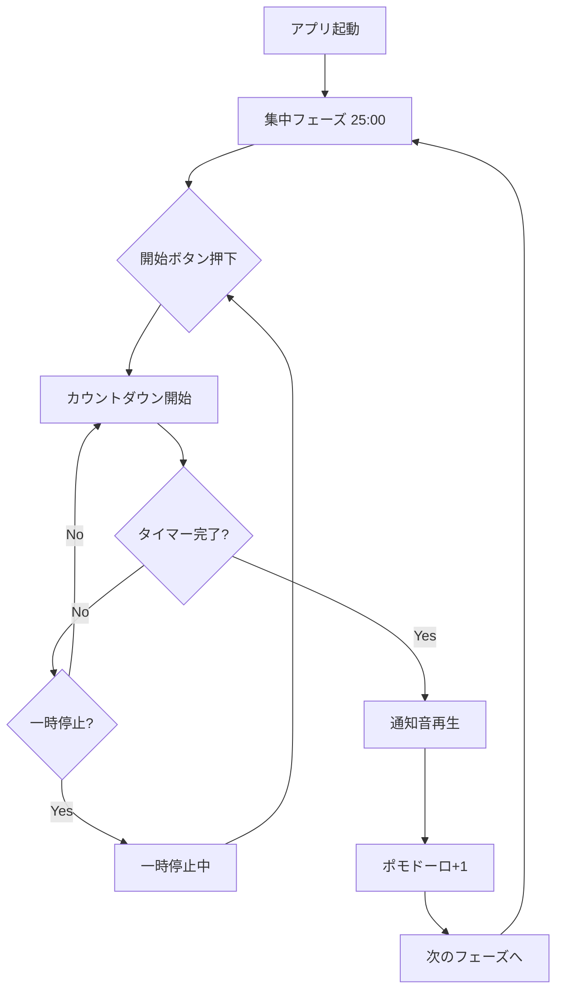

# Tomatic - 機能仕様書

## 概要
Tomaticは、ポモドーロ・テクニックを実践するためのWebアプリケーションです。

---

## 機能一覧

### 1. タイマー機能

#### 1.1 カウントダウン表示
- 残り時間をMM:SS形式で表示
- 円形プログレスリングで進捗を視覚化
- 実行中は発光アニメーション

#### 1.2 タイマー制御
| 操作 | 説明 |
|------|------|
| 開始 | タイマーをスタート |
| 一時停止 | タイマーを停止（再開可能） |
| リセット | 現在のフェーズを初期時間に戻す |
| スキップ | 次のフェーズへ移動 |

---

### 2. フェーズ管理

#### 2.1 フェーズ種類
| フェーズ | 時間 | 説明 |
|---------|------|------|
| 集中 | 25分 | 作業に集中する時間 |
| 短い休憩 | 5分 | 短い休息 |
| 長い休憩 | 15分 | 4ポモドーロ後の休息 |

#### 2.2 フェーズサイクル
```
[集中] → [短休] → [集中] → [短休] → [集中] → [短休] → [集中] → [長休] → (繰り返し)
```

#### 2.3 自動遷移
- タイマー完了時に自動で次のフェーズへ移行
- 通知音で完了を知らせる

---

### 3. 通知機能

#### 3.1 サウンド通知
- Web Audio APIによるビープ音
- フェーズ完了時に800Hz、0.5秒間再生

---

### 4. 統計表示

#### 4.1 ポモドーロカウンター
- 完了した集中フェーズの数を表示
- セッション中は累積（リロードでリセット）

---

## 画面構成

```
┌──────────────────────────────────┐
│           TOMATIC                │ ← タイトル（レインボーグラデーション）
│         ● 集中                   │ ← フェーズインジケーター
├──────────────────────────────────┤
│                                  │
│      ╭──────────────────╮        │
│      │                  │        │
│      │      25:00       │        │ ← タイマー表示
│      │                  │        │    （円形プログレスリング）
│      ╰──────────────────╯        │
│                                  │
│       ⟲      ▶      ⏭           │ ← 操作ボタン
│                                  │
├──────────────────────────────────┤
│     完了したポモドーロ    0      │ ← 統計
└──────────────────────────────────┘
```

---

## ユーザーフロー



---

## 今後の拡張予定

- [ ] 設定画面（時間カスタマイズ）
- [ ] ローカルストレージ保存
- [ ] PWA対応
- [ ] デスクトップ通知
- [ ] 統計グラフ
